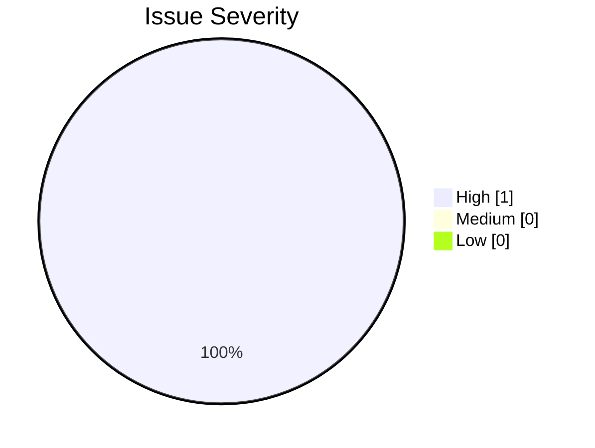

# Enzo.Helpers.CodeReviewer

## Overview

`Enzo.Helpers.CodeReviewer` is a lightweight AI-assisted code reviewer implemented as a .NET 10 file-based C# application.

It reviews pull request diffs using external review skills and OpenAI, validates inline comment locations against the actual diff, prints a structured review report to stdout, and posts an advisory GitHub Pull Request Review report using the Enzo Code Reviewer GitHub App identity. When Enzo can safely propose an exact localized fix, inline comments use GitHub's native commit-able suggestion Markdown.

## Architecture

```text
Consuming repository
        |
        | OPENAI_API_KEY
        | Enzo Code Reviewer GitHub App ID
        | Enzo Code Reviewer GitHub App private key
        v
Reusable GitHub Actions workflow
        |
        | creates installation token
        v
Code Reviewer
        |
        | sends PR diff and review skills
        v
OpenAI
        |
        | returns structured findings, remediation, and advice
        v
GitHub Pull Request Review report plus valid inline issue comments or commit-able suggestions
```

The GitHub review is always submitted with the `COMMENT` event. It does not approve PRs, request changes, or block merges.

OpenAI performs the review analysis. `Enzo.Ai.Skills` provides external review guidance. The Enzo Code Reviewer GitHub App provides the GitHub identity used to publish PR reviews.

The reviewer intentionally separates issues from advice:

```text
Issues
-> actionable problems worth fixing

Advice
-> useful non-blocking recommendations
```

Every successful GitHub Actions review publishes an overall Enzo Code Reviewer PR report. Valid issue locations may also receive inline comments for local context. Some inline comments include GitHub native commit-able suggestions. Advice is included only in the overall report and is not posted inline.

## Enzo.Ai.Skills

Review instructions are maintained separately in the public `Enzo.Ai.Skills` repository.

The reviewer is not coupled to how that repository is obtained. It only receives a filesystem path and recursively discovers files named `SKILL.md`.

Expected convention:

```text
Enzo.Ai.Skills/
├── dotnet-backend/
│   └── SKILL.md
├── dotnet-testing/
│   └── SKILL.md
└── ef-core/
    └── SKILL.md
```

Those skill names are examples only. Nested directories are supported, and all discovered `SKILL.md` files are loaded.

## Local Setup

Recommended local workspace:

```text
workspace/
├── Enzo.Helpers.CodeReviewer/
└── Enzo.Ai.Skills/
```

Requirements:

- .NET 10 SDK with C# file-based app support
- A unified diff file to review
- External skills containing at least one `SKILL.md`
- An OpenAI API key provided through `OPENAI_API_KEY`

## OpenAI Configuration

For review analysis, the reviewer reads OpenAI credentials from `OPENAI_API_KEY`.

PowerShell:

```powershell
$env:OPENAI_API_KEY="<your-api-key>"
```

Bash:

```bash
export OPENAI_API_KEY="<your-api-key>"
```

Do not store API keys in repository files.

## Local Usage

Run from the `Enzo.Helpers.CodeReviewer` directory:

```bash
dotnet reviewer.cs changes.diff --skills ../Enzo.Ai.Skills
```

`changes.diff` is an existing unified diff file, such as output from `git diff`.

`--skills` points to the external skills directory that contains `SKILL.md` files.

Local review generation does not require GitHub App credentials. If GitHub publishing context is unavailable, the reviewer prints the same logical report and skips GitHub publishing.

Example output:

````markdown
# 🤖 Enzo Code Reviewer

## 🔍 Issues Found

### 🔴 HIGH

#### 1. Concurrent DbContext usage

**Location:** `src/Repositories/UserRepository.cs:42`

Multiple EF Core operations are being started concurrently on the same DbContext.

**Action**

Execute them sequentially or use independent DbContext instances.

### 🤖 Use this prompt with your coding agent

> Fix the concurrent DbContext usage in src/Repositories/UserRepository.cs around line 42. Preserve existing behavior and add focused validation.

---

## 📊 Statistics

**Added lines:** 80
**Issues found:** 1
**Issue density:** 1.3 findings per 100 added lines

### Severity Distribution

- 🔴 High: 1 — 100.0%
- 🟡 Medium: 0 — 0.0%
- 🔵 Low: 0 — 0.0%


````

If there are findings, they are grouped in this order: HIGH, MEDIUM, LOW. Numbering resets inside each severity group, and severities with zero findings are omitted from the Issues Found section. Each issue includes a location, explanation, action, and one remediation path.

## Remediation Modes

Every issue has a coding-agent prompt available as a fallback. When the fix is safe, exact, localized, and maps to changed lines in the PR diff, Enzo may also provide a GitHub native code suggestion.

Use a commit-able suggestion when Enzo can confidently provide the exact replacement for one changed line or a small contiguous changed range. Typical examples are null guards, incorrect conditions, wrong API calls, small async corrections, missing cancellation-token propagation, simple disposal fixes, straightforward validation, and small localized EF Core corrections.

Inline GitHub comments with a valid suggestion look like this:

````markdown
🔴 **Possible null dereference**

`request.Name` can be accessed when `request` is null.

```suggestion
if (request is null)
{
    throw new ArgumentNullException(nameof(request));
}

return request.Name;
```

**Suggested commit:** `fix: handle null request before accessing name`
````

GitHub exposes its native **Commit suggestion** experience for comments that contain a valid suggestion block on a pull request diff line or range. GitHub asks the person applying the suggestion to provide the commit message; Enzo cannot set that message through the review comment. Enzo therefore renders a recommended Conventional Commit message immediately below the suggestion.

Use the coding-agent prompt when an exact localized replacement would be unsafe or insufficient, including architectural changes, concurrency redesign, transaction-boundary issues, multi-file fixes, complex security changes, substantial refactoring, ambiguous implementation choices, or issues requiring broader repository context.

Fallback inline comments look like this:

```markdown
🟡 **Concurrent DbContext usage**

The same scoped DbContext is currently used by concurrent operations.

**Action**

Change the implementation so operations sharing the context are not executed concurrently.

### 🤖 Use this prompt with your coding agent

> Fix the DbContext concurrency issue in `TransactionRepository.cs` around line 74. The same scoped DbContext is currently used by concurrent operations. Change the implementation so operations sharing the context are not executed concurrently. Preserve existing behavior and avoid unrelated refactoring. Add focused tests for the affected execution path and run the existing tests.
```

Enzo never automatically commits, pushes, merges, approves, or requests changes. Suggestions and commit messages are recommendations for the developer to inspect and apply.

The Statistics section is calculated by the application, not by the model. Added lines are counted from the unified diff across files and hunks while excluding diff headers, `+++` lines, deleted lines, and metadata.

Issue density means:

```text
findings / added lines * 100
```

It is displayed as `findings per 100 added lines`. It is not an estimate of what percentage of the code is defective. If there are zero added lines, issue density is displayed as `N/A`.

If there are no issues but useful advice exists:

```markdown
# 🤖 Enzo Code Reviewer

## 💡 Advice

- Using AsNoTracking() here would avoid unnecessary EF Core tracking because this query is read-only.
```

If there are no issues and no useful advice:

```markdown
# 🤖 Enzo Code Reviewer

## ✨ Good job!

No actionable issues or specific recommendations found. 🚀
```

Findings are validated against `changes.diff` before creating inline comments. A finding with a valid changed new/right-side line may appear both in the report and as an inline GitHub review comment. Suggestion ranges are also validated against changed new/right-side lines before Enzo publishes a suggestion block. If a model-provided location or suggestion range is invalid or stale, only the inline suggestion/comment is omitted or downgraded to the agent-prompt fallback; the issue remains in the overall report.

## GitHub Actions

`Enzo.Helpers.CodeReviewer` is intended to run as a reusable GitHub Actions workflow. Consuming repositories decide when to call it.

Recommended caller workflow:

```yaml
name: Enzo Code Review

on:
  pull_request:
    types:
      - opened

permissions:
  contents: read
  pull-requests: write

jobs:
  review:
    uses: solakpetri/Enzo.Helpers.CodeReviewer/.github/workflows/review.yml@main
    with:
      ENZO_CODE_REVIEWER_APP_ID: ${{ vars.ENZO_CODE_REVIEWER_APP_ID }}
    secrets:
      OPENAI_API_KEY: ${{ secrets.OPENAI_API_KEY }}
      ENZO_CODE_REVIEWER_PRIVATE_KEY: ${{ secrets.ENZO_CODE_REVIEWER_PRIVATE_KEY }}
```

Automatic review is recommended only for `pull_request: opened`:

```text
PR created
    -> review automatically runs once

additional commit pushed
    -> nothing

user wants another review
    -> GitHub Actions -> Re-run jobs
```

The reusable workflow:

```text
checks out source
-> checks out skills
-> generates diff
-> creates an Enzo Code Reviewer GitHub App installation token
-> runs reviewer
-> prints the Enzo Code Reviewer report
-> posts one COMMENT pull request review report as the Enzo Code Reviewer GitHub App
-> includes valid inline issue comments or commit-able suggestions in the same review where possible
```

It uses GitHub-hosted `ubuntu-latest`, sets up .NET 10, checks out `Enzo.Ai.Skills` with `actions/checkout`, generates the PR diff, and runs:

```bash
dotnet reviewer/reviewer.cs changes.diff --skills skills
```

The diff is generated from the pull request base SHA to the pull request head SHA, so the reviewer receives only PR changes. The generated diff file is not committed. The reviewer parses this unified diff to count added lines for statistics and determine valid new/right-side inline comment targets.

The reusable workflow grants only the permissions needed to read repository contents and write pull request reviews:

```yaml
permissions:
  contents: read
  pull-requests: write
```

Consuming repositories should grant the same permissions to the caller workflow. The Enzo Code Reviewer GitHub App installation must also have repository contents read access and pull request write access for the target repository.

## Reusable Workflow Contract

The reusable workflow accepts one non-secret input:

```text
ENZO_CODE_REVIEWER_APP_ID
```

Store the App ID as a repository or organization variable, for example `vars.ENZO_CODE_REVIEWER_APP_ID`.

The reusable workflow explicitly accepts these secrets:

```text
OPENAI_API_KEY
ENZO_CODE_REVIEWER_PRIVATE_KEY
```

Do not use `secrets: inherit`. Pass only the required secrets explicitly.

The GitHub App private key must be stored as a GitHub Actions secret and must never be committed. Consuming repositories provide their own `OPENAI_API_KEY`.

## Authentication

The workflow creates a short-lived installation token with `actions/create-github-app-token@v2` using:

```text
ENZO_CODE_REVIEWER_APP_ID
ENZO_CODE_REVIEWER_PRIVATE_KEY
```

The private key is provided only to the token-generation step. The generated installation token is passed to the reviewer as `GITHUB_TOKEN`:

```yaml
GITHUB_TOKEN: ${{ steps.app-token.outputs.token }}
```

The reviewer does not understand GitHub App authentication. It only uses `GITHUB_TOKEN` to publish the GitHub Pull Request Review request.

The OpenAI API key is passed to the reviewer unchanged:

```yaml
OPENAI_API_KEY: ${{ secrets.OPENAI_API_KEY }}
```

Do not commit API keys, private keys, installation tokens, `.env` files containing credentials, or credential-containing application settings. PR reviews appear under the Enzo Code Reviewer GitHub App identity.

## Current Limitations

The current version:

- reviews PR diffs
- loads external skills
- runs through a reusable GitHub Actions workflow
- prints the structured Enzo Code Reviewer report to workflow logs
- posts a GitHub Pull Request Review report using `COMMENT` as the Enzo Code Reviewer GitHub App
- includes inline comments for issues with valid changed-line locations
- includes GitHub native commit-able suggestions when an exact localized replacement is safe and maps to the PR diff
- recommends Conventional Commit messages for commit-able suggestions
- falls back to directly usable coding-agent prompts when suggestions are unsafe or unmappable
- keeps invalid-location issues in the report while omitting only their inline comments
- publishes advice-only and Good Job fallback reports when there are no issues
- never approves PRs or requests changes

Current limitations:

- manage duplicate reviews

## Roadmap

Duplicate-review handling is planned for a later version. Manually re-running the workflow can create duplicate inline comments.
